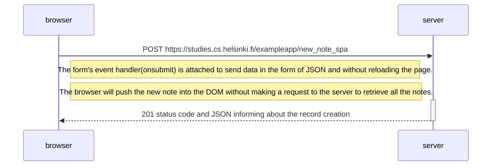

```mermaid
sequenceDiagram
    participant browser
    participant server

    browser->>server: POST https://studies.cs.helsinki.fi/exampleapp/new_note_spa
    Note right of browser: The form's event handler(onsubmit) is attached to send data in the form of JSON and without reloading the page.
    Note right of browser: The browser will push the new note into the DOM without making a request to the server to retrieve all the notes.
    activate server
    server-->>browser: 201 status code and JSON informing about the record creation
    deactivate server
```